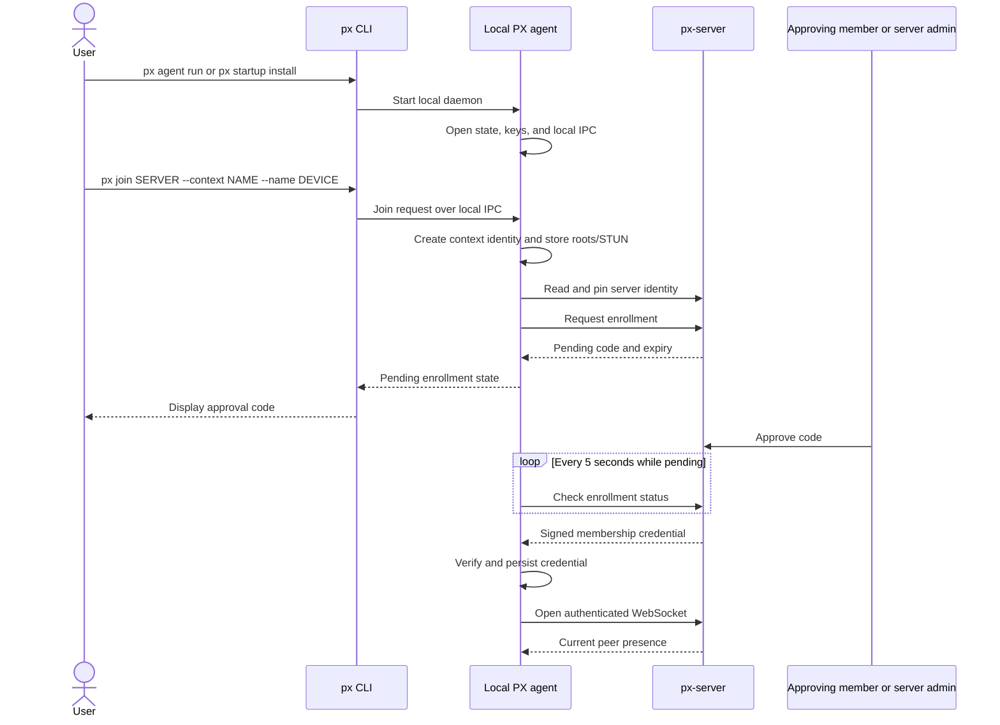
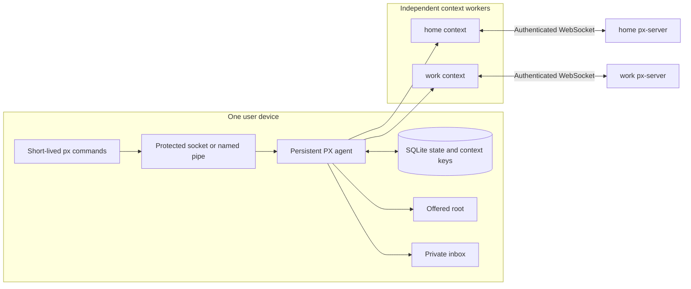
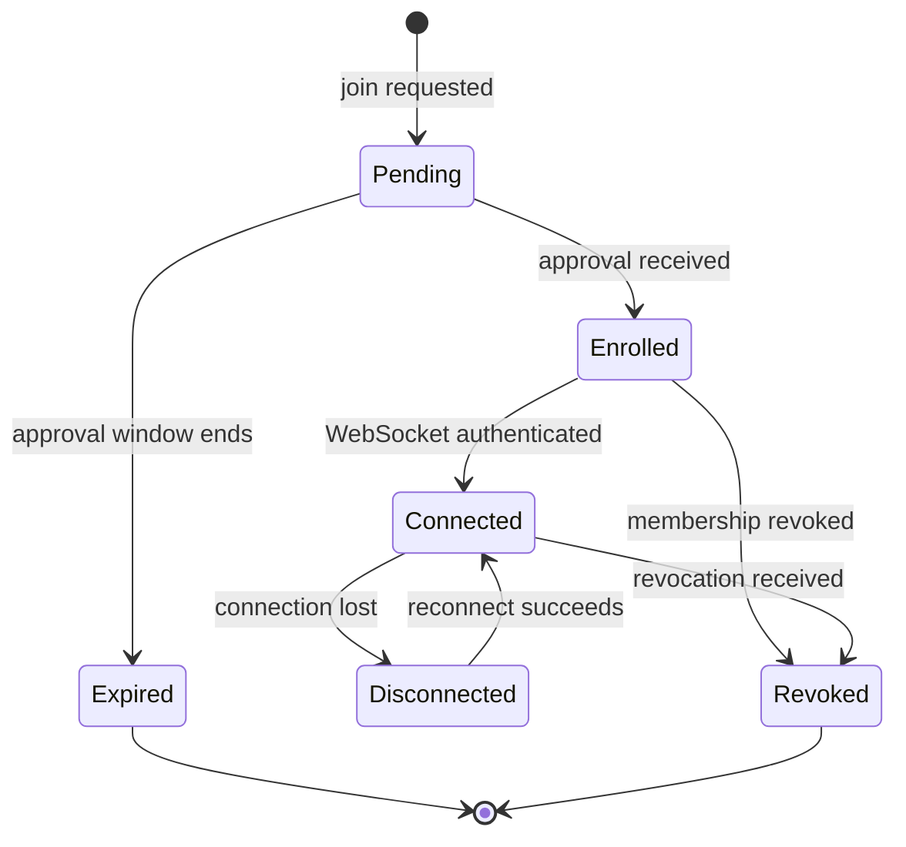
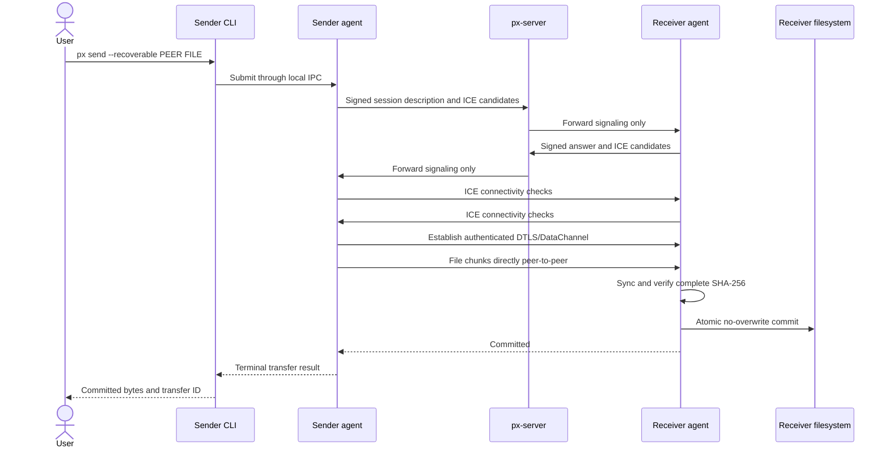

# Agent Lifecycle And Enrollment

PX separates the long-running local agent from short-lived CLI commands. The
agent owns identities, context state, server connections, direct sessions, and
transfers. CLI commands communicate with it through protected local IPC.

## First Setup

`join` does not start the agent. Without `--wait`, it prints the pending state
and exits while the agent continues enrollment. With `--wait`, the CLI polls
the local agent until approval or expiry; the agent remains responsible for
server communication.

The context is durable after enrollment. On future starts, the agent
automatically reconnects every enabled context, so `join` is not part of
normal startup. Inspect it with `px context show [NAME]` and intentionally
change roots or STUN with `px context configure [NAME]`; enrollment commands
are not configuration editors.

## Runtime Ownership

Each context has its own server identity, device identity, credential, label,
aliases, roots and independent offered-root and put-root revisions,
filesystem-root acknowledgement, default-false put policy, presence, and server
connection. Context selection
precedence is `--context`, then `PX_CONTEXT`, then the configured default.

`context show` uses an optional positional name as the most explicit selection
and emits a redacted public configuration DTO. Credentials, private key paths,
pending approval codes, resume tokens, and local runtime endpoints are omitted.
Aliases are context-local and exact for set/show/remove identity, so `Build`
and `build` are distinct aliases that can coexist. Lists are deterministically
sorted. Alias target labels retain the existing case-insensitive peer-label
matching behavior.

## Context States

The agent keeps one WebSocket open per connected context. Presence and
signaling are event-driven. A jittered keepalive runs approximately every 30
seconds and requires a pong within 10 seconds. A dead connection reconnects
with jittered exponential backoff from approximately one second to a bounded
30-second maximum; one successful keepalive resets the backoff. Healthy server
sessions do not expire on a fixed timer.

`px watch` exposes a read-only process-local projection of this lifecycle for
the selected context. Its initial connected or disconnected snapshot is atomic
with future events. A reconnect supplies the complete current peer baseline;
disconnect invalidates peer state and does not fabricate one offline event per
peer. Presence duplicate joins and unknown leaves are suppressed, while a
same-label device identity replacement is reported as old offline then new
online. Sequence values order events; UTC timestamps are informational. A gap or
unexpected stream end requires a new watch and baseline.

The rendezvous server logs authenticated context connection and disconnection
events with the `@label`. It does not log transport or forwarded source
addresses, every keepalive, or any membership credential.

## Context Lifecycle

Context disable, enable, configure, and remove operations are serialized through
the agent's context manager. Disable preserves identity and recovery state while
canceling runtime work. Enable resumes eligible stored state. Configure advances
only the affected read/public-send or put-authority epoch. Remove is the joint
lifecycle boundary and cannot destroy identity that unresolved recovery still
requires.

User commands and removal behavior are in [Usage](../guides/usage.md). Root
validation and authority epochs are in [Filesystem Access](../guides/filesystem-access.md).
Exact retry, permanent blockers, `outcome_unknown`, and `accept-current` are in
[Transfer Recovery](../guides/transfer-recovery.md). STUN replacement and
deployment are in [STUN](../guides/stun.md).

## Direct Operation

The rendezvous server never receives file chunks. It authenticates members,
tracks presence, and forwards bounded signaling envelopes. STUN may help peers
discover NAT mappings, but it also does not carry file data. `px doctor --peer`
reports the selected candidate pair, endpoint addresses, connection setup, and
candidate types. `px ping PEER` reports setup separately from sequential
application RTT samples and omits route addresses unless the operator supplies
`--show-addresses`; `px ping --server` rejects that flag and uses the
already authenticated context WebSocket. Incoming ping sessions have bounded
setup and idle lifetimes and count against the context's 16-session limit.

`px benchmark PEER` opens a separate authenticated `px-benchmark-v1` channel,
measures one RTT, then sends generated 32 KiB messages sequentially in both
directions. Receivers discard payloads. The command shares bounded operation
admission and creates no filesystem or durable state.

## Filesystem Roles

- The offered root is remotely browsable through `ls` and readable through
  `get`, including nested portable relative paths. A filesystem or volume root
  requires explicit durable acknowledgement; there is no absolute-path bypass.
  Contained symlinks may resolve under `os.Root`; escapes are rejected.
- The inbox receives flat filenames beneath `<context>/<sender>/` and is not
  remotely browsable by default.
- Inbox and offered roots are independently configurable per context.
- Sends never overwrite an existing destination.
- Explicit `send --public` publishes a flat file into the receiver's offered
  root, where every trusted context member has read authority.
- Separately enabled put grants every authenticated context member authority to
  create files and request supported replacement at existing-parent relative
  paths. Put rejects every symlink/junction/reparse parent and destination. It is
  not send, and it uses separate protocol and recovery state. See [Filesystem Access](../guides/filesystem-access.md)
  for platform behavior and the [native validation campaign](../validation/native.md)
  for readiness evidence.

## Setup UX

`px onboard` orchestrates the same startup, context, enrollment, and diagnostic
ownership described above. See [Onboarding](../guides/onboarding.md) for interactive and
automated procedures.
